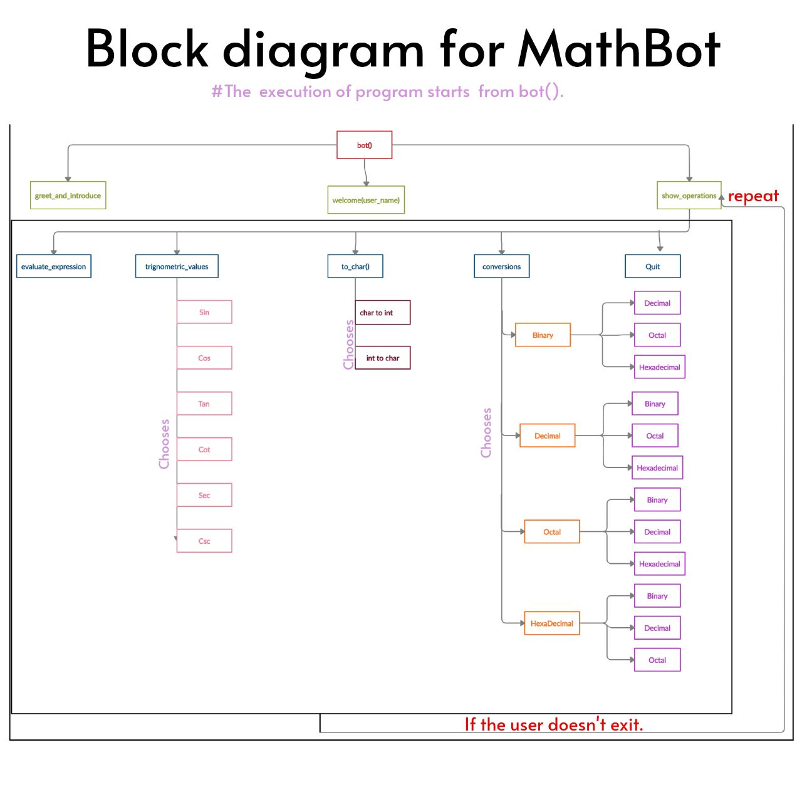

# MathBot
 
# Objective of the MathBot
  This is a program for a chatbot...
    1. The bot will start with a greeting and self introduction and ask for name of the user
    2. The bot will greet and welcome the person
    3. Bot will ask what a person want to do, it will offer a set of choices based upon what the bot is designed for
    4. It will respond to the user input appropriately 
    
# Working of MathBot
1. The execution of the program starts with the bot().
2. The bot() calls the greet_and_introduce(), welcome(name) and show_operations().
      greet_and_introduce() greets the user and the chatbot introduces itself.
      welcome(name) welcomes the user and ask the user's name.
      show_operations() displays the set of operations the bot is designed for.
3. If the user's choice is 1
      evaluate_expression() is executed according to the user's input expression.
4. If the user's choice is 2
      trignometric_val() is executed according to the user's valid options.
5. If the user's choice is 3
      to_char() is executed according to the user's valid options.
6. If the user's choice is 4
      numeric conversions are performed according to the user's choice.
7. If the user's choice is 5
      The program will terminate.
      
# Block Diagram of MathBot 

# Youtube Video
https://youtu.be/0didH6jKvIs

# Reference links 
https://youtu.be/C6X71gjB9pA
